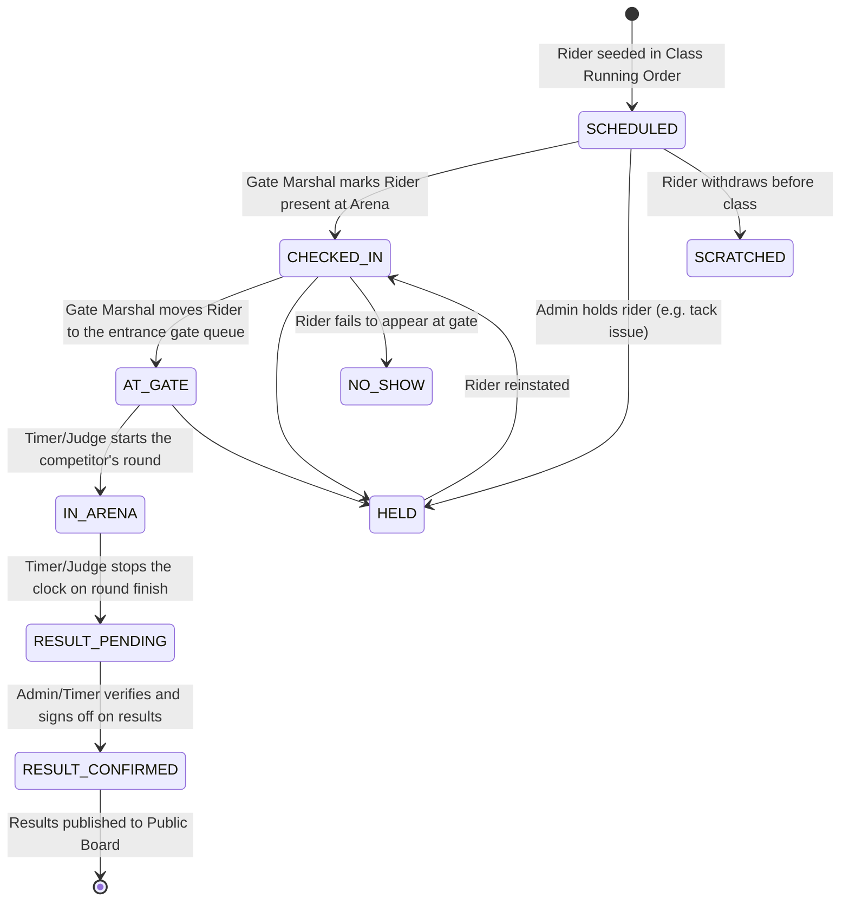
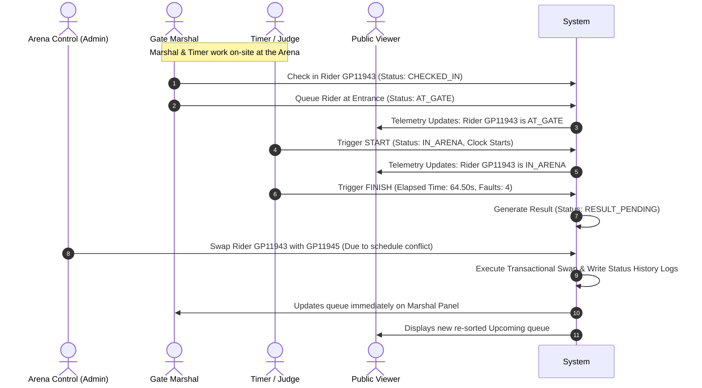

# LiveRide Show Platform — Complete Architecture & User Manual

Welcome to the central documentation hub for **LiveRide Show Platform**, the modern digital solution for live horse showriding and showjumping events. This document details the platform's core mission, stakeholder value, technical system flows, database structures, role-specific user manuals, and a curated presentation of our working MVP.

---

## 1. Introduction & Value Proposition

### What is LiveRide?
Showjumping and showriding events are fast-paced, multi-arena sports that rely on tight coordination. Historically, arenas are managed using paper draw-sheets, walkie-talkies, and manual clipboards. This leads to scheduling bottlenecks, delays, and a complete lack of real-time visibility for competitors and spectators scattered across showgrounds.

**LiveRide Show Platform** is a web-based, real-time event telemetry system that bridges the gap between show organizers, gate marshals, judges/timers, and the public. 

### Why is it Required?
* **Communication Overhead**: Gate marshals spent hours chasing down riders who missed their slots due to lack of visibility.
* **Timing & Accuracy Bottlenecks**: Timekeepers manually transcribe elapsed seconds and penalties, risking calculation errors and delays in publishing results.
* **Draw Reordering Friction**: Swapping two riders on paper causes visual clutter, and updating the schedule without notifying the gate leads to chaos.
* **Disengaged Spectators**: Family, coaches, and sponsors have no way to track when a rider is entering the ring other than standing directly next to the arena.

### Stakeholder Value Matrix

| Role | Operational Problem | LiveRide Solution | Measurable Value |
|---|---|---|---|
| **Admin / Organizer** | Managing schedule shifts, tracking arena delays, and handling order dispute resolutions. | **Event Control Room Dashboard** with transactional rider swapping and a real-time system audit feed. | 100% accurate database order updates with strict audit trails and zero index conflicts. |
| **Gate Marshal** | Checking in riders on paper, arranging the gate queue, and screaming for missing riders. | **Marshal Queue Panel** showing checked-in riders, gate readiness, and active ring status. | Paperless check-ins, instant draw updates, and visual gate queues. |
| **Timer / Judge** | Manually starting clocks, noting faults, calculating penalties, and recording times. | **Judge's Cockpit** with one-click Start/Finish event capture and automated result creation. | Instant, error-free result generation and immediate database logging. |
| **Public Viewer** | Missing rounds, guessing who is in the ring, and waiting hours for paper printouts. | **Public Telemetry Board** showing current, upcoming (next 3), and recently completed riders. | Absolute real-time visibility from any smartphone or mobile device. |

---

## 2. Platform System Flows

The lifecycle of a single showjumping entry is governed by a precise state-machine to ensure data integrity across all screens.

### Rider Status Lifecycle


### Role Interaction Flow


---

## 3. Database Entity Relationship Diagram (ERD)

The SQLite relational schema is built to ensure zero data duplication while supporting complex equestrian structures (e.g., a single rider riding multiple horses across different classes).

```mermaid
erDiagram
    EVENT ||--o{ ARENA : "contains"
    EVENT ||--o{ COMPETITION_CLASS : "groups"
    ARENA ||--o{ COMPETITION_CLASS : "hosts"
    
    SCHOOL ||--o{ RIDER : "educates"
    RIDER ||--o{ RUNNING_ORDER : "competes in"
    HORSE ||--o{ RUNNING_ORDER : "ridden in"
    
    COMPETITION_CLASS ||--o{ RUNNING_ORDER : "schedules"
    
    RUNNING_ORDER ||--|| RESULT : "produces"
    RUNNING_ORDER ||--o{ STATUS_HISTORY : "audits"
    RUNNING_ORDER ||--o{ TIMER_EVENT : "logs"

    EVENT {
        string id PK
        string name
        datetime eventDate
        string venue
        string qualifier
        string status "ACTIVE | UPCOMING | COMPLETE"
    }

    ARENA {
        string id PK
        string eventId FK
        string name
        string discipline
        string status "ACTIVE | PAUSED | ARENA_RAKE | COURSE_CHANGE | COMPLETE"
        int sortOrder
    }

    COMPETITION_CLASS {
        string id PK
        string eventId FK
        string arenaId FK
        string classCode UK
        string name
        string discipline
        string height
        string competitionType
        string scheduledStartTime
        int expectedRiders
        string status "PENDING | ACTIVE | COMPLETE"
    }

    RIDER {
        string id PK
        string riderNo UK "SANESA membership number"
        string fullName
        string schoolId FK
    }

    SCHOOL {
        string id PK
        string name UK
    }

    HORSE {
        string id PK
        string name UK
        string type "HORSE | PONY"
    }

    RUNNING_ORDER {
        string id PK
        string classId FK
        string riderId FK
        string horseId FK
        int plannedOrderNo
        int actualOrderNo
        string status "SCHEDULED | CHECKED_IN | AT_GATE | IN_ARENA | FINISHED..."
        boolean orderChanged
        string orderChangeReason
        string notes
        datetime checkedInAt
        datetime startedAt
        datetime finishedAt
    }

    RESULT {
        string id PK
        string runningOrderId FK UK
        float elapsedSeconds
        int faults
        int penalties
        int placing
        string resultStatus "PENDING | CONFIRMED | DISPUTED"
        boolean published
    }

    STATUS_HISTORY {
        string id PK
        string runningOrderId FK
        string oldStatus
        string newStatus
        string reason
        string changedBy
        datetime changedAt
    }

    TIMER_EVENT {
        string id PK
        string runningOrderId FK
        string eventType "START | FINISH | FAULT_ADD | FAULT_REMOVE | CORRECTION"
        datetime eventTime
        string source
        string capturedBy
    }
```

---

## 4. User Manuals: Step-by-Step How-To Guides

### 1. Admin: Managing the Arena Control Room
**Objective**: Monitor arena activity, handle delays, shift/swap orders, and manually override competitor statuses.

* **Changing Arena Operational States**:
  1. Navigate to `/admin/arenas/[arenaId]`.
  2. Locate the **Arena System Flow** card.
  3. Select one of the status buttons: `ACTIVE` (normal flow), `PAUSED` (hold all), `ARENA_RAKE` (blinks yellow warning to pause gates), `COURSE_CHANGE` (alerts crew to modify jumps), or `COMPLETE`.
* **Swapping Rider Order (Draw Position)**:
  1. Scroll to the **Immediate Queue** on the control board.
  2. Click the **Move Up** (▲) or **Move Down** (▼) arrow button next to the target rider.
  3. A swap dialog will slide open showing who the rider is swapping positions with.
  4. Select a pre-filled reason (e.g. *Scheduling clash*) or type a custom reason.
  5. Click **Confirm Swapped Positions**. The system executes a safe database swap and appends audit logs.
* **Executing Manual Status Overrides**:
  1. Click the **Override Status** gear icon next to any rider.
  2. Select the target state (e.g., `HELD`, `SCRATCHED`, `IN_ARENA`).
  3. Type a required reason and click **Commit State Override**.

---

### 2. Gate Marshal: Coordinating the Arena Gate
**Objective**: Check riders in as they arrive at the warm-up ring, move them to the entrance gate queue, and coordinate flow.

* **Checking In a Competitor**:
  1. Access the Gate Marshal panel at `/gate`.
  2. Locate the rider in the class roster.
  3. Click **Check In**. The competitor's status updates to `CHECKED_IN`, letting the judge know they are on-site.
* **Moving a Rider to the Gate Entrance**:
  1. Find a checked-in rider.
  2. Click **Move to Gate**. The competitor's status updates to `AT_GATE` (pulsing blue). They are now queued to enter the ring.
* **Handling Scratchings / No-Shows**:
  1. If a rider fails to appear after multiple announcements, select **No Show** or **Scratch** from the actions list. They are removed from the active queue.

---

### 3. Timer & Judge: Operating the Clock
**Objective**: Track competitor round starts, record elapsed times, faults, and lock in results.

* **Starting a Round**:
  1. Navigate to `/timer`.
  2. The screen automatically displays the rider currently marked `AT_GATE` as the next up.
  3. As the rider crosses the start line, click **START TIMER**. The status transitions to `IN_ARENA` and telemetry starts updating.
* **Stopping a Round & Submitting Times**:
  1. When the rider crosses the finish line, click **FINISH TIMER**.
  2. Enter the final **Elapsed Time** (in seconds) and **Faults** (knockdowns, refusals) from the judge's score sheet.
  3. Select the round outcome (`FINISHED`, `ELIMINATED`, or `RETIRED`).
  4. Click **Submit Result**. The round is marked `FINISHED` / `RESULT_PENDING`, and the rider moves to the completed queue, clearing the ring for the next gate rider.

---

### 4. Public Spectator: Following the Action
**Objective**: Stay updated on arena flow, track active riders, and view results from any location.

* **Accessing Live Updates**:
  1. Open a mobile browser and visit the home dashboard (`/` or `/arena/[arenaId]`).
  2. Select your target arena (e.g., Peter Minnie Arena).
  3. The screen displays three highly visible cards:
     * **Now Riding**: The competitor currently inside the ring.
     * **Up Next**: The next three queued riders.
     * **Recent Results**: Completed rounds with faults, times, and rankings.

---

## 5. LiveRide Show MVP Presentation

The following interactive presentation provides a structured summary of the LiveRide Show MVP, explaining its components, data states, and future directions.

````carousel
### Slide 1 — LiveRide Show Platform MVP Overview
#### Re-imagining Equestrian Show Management

LiveRide is a real-time event telemetry system designed specifically for school showriding and showjumping tournaments. It digitizes the entire lifecycle of an entry, linking coordinators, arena marshals, judges, and viewers on a single platform.

* **The Problem**: Paper draw sheets, slow timing transcription, poor spectator visibility.
* **The Goal**: Create a working demo that handles live check-ins, automatic swaps, active timing, and live viewer feeds across multiple arenas.

*LiveRide makes event orchestration as fluid as the rounds themselves.*
<!-- slide -->
### Slide 2 — The Core Architecture & Technology
#### Lean, Highly Responsive, and Fully Typed

The LiveRide MVP is built using modern web development standards to ensure maximum speed and zero dependencies:

* **Next.js & React**: Utilizing React Server Components and client-side hooks to manage live states.
* **Vanilla Tailwind CSS**: Styled to replicate high-end telemetry dashboards.
* **SQLite & Prisma ORM**: Relational SQLite database with strict unique indices preventing duplicate draws (`[classId, plannedOrderNo]`) and duplicate riders (`[classId, riderId]`).
* **Instant Telemetry API**: Handlers to control draw swaps (`/api/running-orders/change-order`), status overrides (`/api/status-update`), and timing (`/api/timer`).
<!-- slide -->
### Slide 3 — The Live Arena Control Room (Admin Screen)
#### Complete Command Over the Arena

The newly designed **Admin Arena Control Room** at `/admin/arenas/[arenaId]` feels like a high-tech event cockpit:

* **Glowing Telemetry Indicators**: Dynamic rings pulse based on active states (`ACTIVE`, `PAUSED`, `ARENA_RAKE`, `COURSE_CHANGE`).
* **Flow Pause Warners**: Flashes bright alert boxes during rakes or course adjustments.
* **Conflict-Free Swapping**: Click up/down arrows to trigger transactional order swaps. The backend safely swaps competitors and generates audit histories for both.
* **Comprehensive Audit Feed**: Scrolling chronological feed of all actions, draw moves, or state overrides for absolute transparency.
<!-- slide -->
### Slide 4 — Gate Marshal & Timekeeper Cockpits
#### Smooth Operational Handshakes

The event flow depends on two vital screens that coordinate in real time:

* **Gate Marshal Panel (`/gate`)**:
  * Clean class rosters.
  * Simple buttons to transition competitors: `SCHEDULED` &rarr; `CHECKED_IN` &rarr; `AT_GATE`.
* **Judge's Timer Cockpit (`/timer`)**:
  * Focuses on the rider marked `AT_GATE`.
  * Click **Start** to transition status to `IN_ARENA`.
  * Click **Finish** to record elapsed seconds, knockdowns, and final outcome.
  * Auto-creates the pending `Result` database entry.
<!-- slide -->
### Slide 5 — Seeded Demo & Future Roadmap
#### Believable Data and Next Steps

The LiveRide demo is fully pre-seeded with a comprehensive set of tournament data representing the **SANESA Ekurhuleni Qualifier 3**:

* **Seeded Assets**: 3 active arenas, 6 classes, 38 running orders, 13 pre-seeded results, and 68 historical audit logs.
* **Realistic Event State**:
  * *Peter Minnie Arena*: `ACTIVE` (110cm in progress).
  * *May Foxcroft Arena*: `ARENA_RAKE` (warning active).
  * *Small Sand Arena*: `ACTIVE` (75cm starting soon).

* **Future Enhancements**:
  * Real-time sync via WebSockets or Server-Sent Events (SSE).
  * Direct electronic integration with physical timer beams.
  * Automated placings calculator for speed classes and jump-offs.
````
